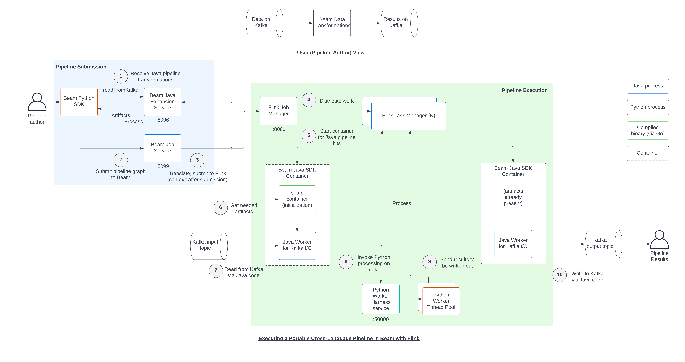

## Utilizing Apache Flink

Apache Flink allows for parallel streaming processing of data from either files (batch)
or true streaming (via message broker like Pub/Sub, Kafka, RabbitMQ, etc.).

Two ways for python developers to leverage Flink is either indirectly via Apache Beam
or the native [apache-flink](https://pypi.org/project/apache-flink/) library. For pros
and cons of using Apache Beam, see [this](https://ndeepak.com/posts/2022-07-07-local-beam/)
and [this](https://ndeepak.com/posts/2023-04-26-beam-careful/) article by Deepak Nagaraj.
The complexity highlighted in these article is aluded to by the
[SDK Harness Config docs](https://beam.apache.org/documentation/runtime/sdk-harness-config/)
for Apache Beam which shows the need to package, maintain, and troubleshoot custom docker
images for each execution environment a beam pipeline may try to execute. See the excerpt
of this complex workflow for basic Apache Beam tasks below.

## Configuring Traefik securely
[Mozilla SSL Configuration Generator](https://ssl-config.mozilla.org/#server=traefik&version=2.1.2&config=modern&guideline=5.7) is
a nice tool for seeing good default configuration options.
