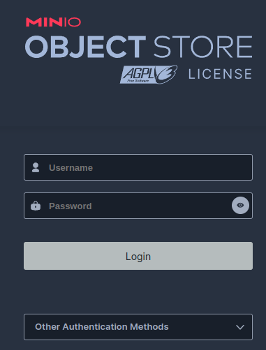
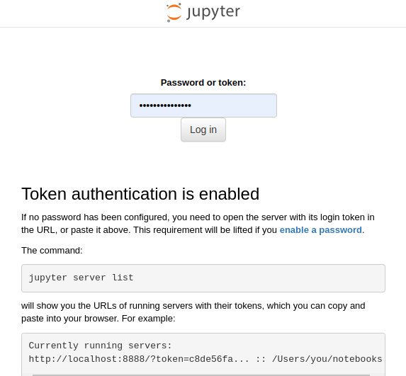
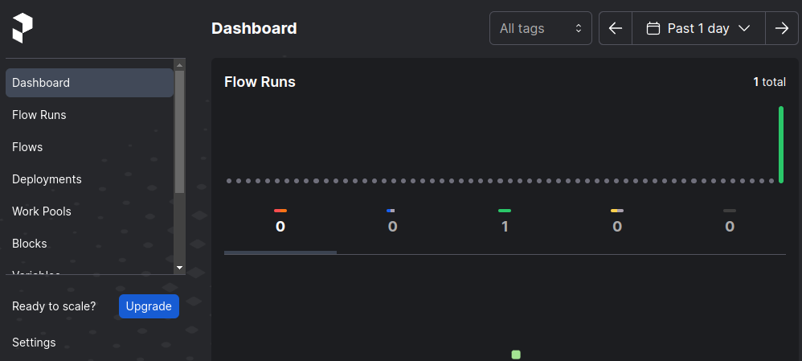
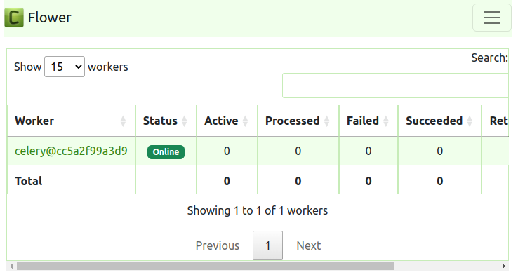
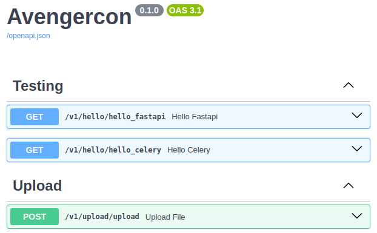
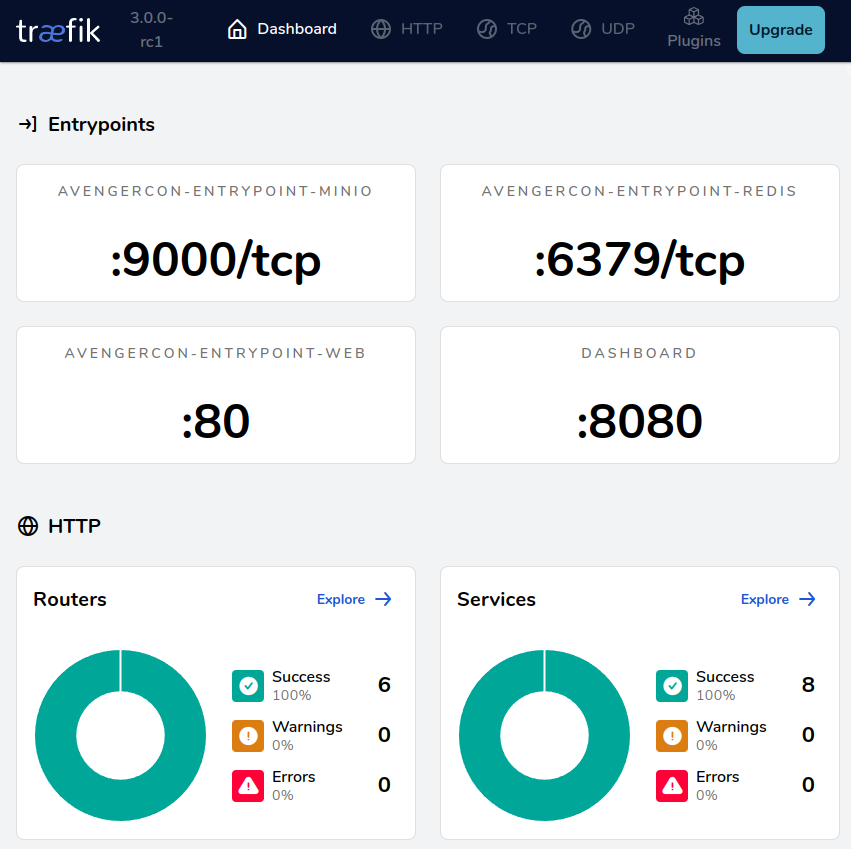

This is the beginning of our journey. Our goal is simple but not always easy: can we
get our developer environment setup?

[](https://xkcd.com/1987/)

## **Get Ready**: System-level installation


You'll need the following software installed to begin:

1. [Docker](https://docs.docker.com/engine/install/)
2. [Python 3.11](https://www.python.org/downloads/)
3. [Git](https://git-scm.com/downloads)

!!! note "Optional software"
    === "Python interpreter manager"
        To keep Python from messing up your OS configs, It is recommended to install &
        manage Python interpreters using a manager like
        [pyenv](https://github.com/pyenv/pyenv?tab=readme-ov-file#installation) or
        [hatch](https://hatch.pypa.io/latest/). This will allow you to add/remove specific
        and multiple Python environments on your system. Testing your code against multiple
        versions of Python is a necessity for professional projects!
    === "Poetry"
        [Poetry](https://python-poetry.org/docs/#installation) is an alternative to `pip`.
        Those who prefer `pip` or other Python environment tools are welcome to use the
        `requirements-dev.txt` file in the **requirements** directory of this repo.
        <br/>**Why Poetry?**<br/>
        While hatch and other tools are promising, as of this workshop Poetry remains one
        of the best developer experiences (DX) for setup of python virtual environments and
        [modern pyproject.toml based Python packages](https://packaging.python.org/en/latest/specifications/pyproject-toml/#pyproject-toml-spec).
    === "Git GUI Client"
        [Git GUI Clients](https://git-scm.com/downloads/guis) simply save time. While it
        may feel nice to flex that you have every possible permutation of Git commands
        memorized, 2-second point-and-click to stage dozens of files and side-by-side
        highlighted diffs are the way to go.

## **Get Set**: Prepare your virtual environment

### Install the `avengercon` package and dependencies

1. Establish a virtual environment with `poetry shell` or [use pip](https://packaging.python.org/en/latest/guides/installing-using-pip-and-virtual-environments/#create-and-use-virtual-environments)
2. Install `avengercon` & dependencies with `poetry install` or [use pip](https://packaging.python.org/en/latest/guides/installing-using-pip-and-virtual-environments/#using-a-requirements-file)
3. Confirm that the local `avengercon` package is available in your virtual environment

```bash
(avengercon-py3.11) $ python -m avengercon
Hello, Workshop!
```

### Configure your IDE to use the virtual environment
[VSCode](https://code.visualstudio.com/docs/python/environments),
[PyCharm](https://www.jetbrains.com/help/pycharm/creating-virtual-environment.html), and
most other popular Integrated Development Environment (IDEs) support intellisense and
other productivity boosters when properly configured to use the project's virtual
environment.

### Generate your `.env` file
Using a terminal from the top level `avengercon_2024` directory, run the
`initialize_env.sh` script to dynamically generate configuration metadata in a `.env`
file.

=== "Windows"
    ``` cmd
    bash scripts\initialize_env.sh
    ```

=== "Unix (Mac/Linux)"
    ``` bash
    chmox +x scripts/initialize_env.sh
    ./scripts/initialize_env.sh
    ```

You should now see a `.env` file in your `avengercon_2024` directory that looks
something like this:
``` toml title=".env"
# Used by run_*.sh scripts & avengercon module to dynamically configure localhost
# development and testing environment variable coordination.
# Valid log level values: 'critical', 'error', 'warning', 'info', 'debug'
LOG_LEVEL=info
# Traefik settings and labels
HTTP_PORT=57073
DOMAIN=localhost
...
```

## 🚀 **Launch!**
Using a terminal from the top level `avengercon_2024` directory, launch the `docker
compose` deployment using the `run_dev.sh` script.

=== "Windows"
    ``` cmd
    bash run_dev.sh
    ```

=== "Unix (Mac/Linux)"
    ``` bash
    chmox +x run_dev.sh
    run_dev.sh
    ```

!!! warning "Keep your containers deployed"
    Don't close the terminal running your deployment! We'll be using the logs that
    appear to help monitor the state of our workshop's services and code.

!!! note "Port conflicts"
    If you're already running a Traefik reverse proxy or services that use the ports
    listed in the `.env`, you will need to adjust the ports being used for this workshop.

If everything is going well, you should not see any "ERR" or "ERROR" in the logs that
appear in your terminal.
``` terminal title="Happy Logs"
...
avengercon-minio   | Documentation: https://min.io/docs/minio/linux/index.html
avengercon-minio   | Warning: The standard parity is set to 0. This can lead to data loss.
avengercon-proxy   | 2024-02-15T16:35:39Z INF Traefik version 3.0.0-rc1 built on 2024-02-13T13:41:20Z version=3.0.0-rc1
avengercon-proxy   | 2024-02-15T16:35:39Z INF
avengercon-proxy   | Stats collection is disabled.
avengercon-proxy   | Help us improve Traefik by turning this feature on :)
avengercon-proxy   | More details on: https://doc.traefik.io/traefik/contributing/data-collection/
avengercon-proxy   |
avengercon-proxy   | 2024-02-15T16:35:39Z INF Starting provider aggregator aggregator.ProviderAggregator
avengercon-proxy   | 2024-02-15T16:35:39Z INF Starting provider *docker.Provider
avengercon-proxy   | 2024-02-15T16:35:39Z INF Starting provider *traefik.Provider
avengercon-proxy   | 2024-02-15T16:35:39Z INF Starting provider *acme.ChallengeTLSALPN
avengercon-minio   |
avengercon-minio   |  You are running an older version of MinIO released 1 day before the latest release
avengercon-minio   |  Update: Run `mc admin update ALIAS`
avengercon-minio   |
avengercon-minio   |
avengercon-whoami  | 2024/02/15 16:38:02 172.27.0.3:45642 - - [15/Feb/2024:16:38:02 +0000] "GET / HTTP/1.1" - -
...
```

### Verify you can access your deployed services
Ensure you can open a web browser to the following local services. For each button,
**you probably want to right-click and open in new tab**.

If anything fails to open, double-check the port in the opened link matches the port
specified by `HTTP_PORT` in your `.env` configuration. (default is `57073`; l33t speak
approximation for "Stone")

=== "Whoami"
    [Whoami :octicons-home-24:](http://whoami.localhost:57073/){ .md-button .md-button--primary}

    ``` txt title="whoami.localhost"
    Name: avengercon_whoami
    Hostname: b967780eb9c6
    IP: 127.0.0.1
    IP: ###.###.###.###
    RemoteAddr: ###.###.###.###:42012
    GET / HTTP/1.1
    Host: whoami.localhost:57073
    User-Agent: Mozilla/5.0 (X11; Linux x86_64) AppleWebKit/537.36 (KHTML, like Gecko) Chrome/121.0.0.0 Safari/537.36
    Accept: text/html,application/xhtml+xml,application/xml;q=0.9,image/avif,image/webp,image/apng,*/*;q=0.8,application/signed-exchange;v=b3;q=0.7
    Accept-Encoding: gzip, deflate, br
    ...
    ```

=== "Redis"
    [Redis :simple-redis:](http://cache.localhost:57073/){ .md-button .md-button--primary}

    The login is `default` and the password is in your `.env` as the `REDIS_PASSWORD`
    value

    

=== "MinIO"
    [MinIO :simple-minio:](http://bucket.localhost:57073/){ .md-button .md-button--primary}

    The login and password is in your `.env` as the `MINIO_ROOT_USER`
    and `MINIO_ROOT_PASSWORD` values

    

=== "Dask"
    [Dask :simple-dask:](http://dask.localhost:57073/status){ .md-button .md-button--primary}

    

=== "Dask Notebook"
    [Jupyter Notebook :simple-jupyter:](http://notebook.localhost:57073/){ .md-button .md-button--primary}

    Your login token will be listed in the terminal next to an `avengercon-dask-notebook`
    log entry. You'll need to copy-paste just the token portion of the url

    ``` terminal hl_lines="2"
    avengercon-dask-notebook       | [... ServerApp] Jupyter Server 2.12.5 is running at:
    avengercon-dask-notebook       | [... ServerApp] http://fd52fdf68911:8888/lab?token=b952e22de792f69923d281c04f66393518cd74a0c7fd1acf
                                                EVERYTHING AFTER THE = IS YOUR TOKEN    ^^^^^^^^^^^^^^^^^^^^^^^^^^^^^^^^^^^^^^^^^^^^^^^^

    avengercon-dask-notebook       | [I 2024-02-17 19:42:45.576 ServerApp]     http://127.0.0.1:8888/lab?token=b952e22de792f69923d281c04f66393518cd74a0c7fd1acf
    avengercon-dask-notebook       | [I 2024-02-17 19:42:45.576 ServerApp] Use Control-C to stop this server and shut down all kernels (twice to skip confirmation).
    ```

    

=== "Prefect"
    [Prefect :simple-prefect:](http://prefect.localhost:57073/dashboard){ .md-button .md-button--primary}

    

=== "Celery (Flower)"
    [Celery :simple-celery:](http://celery.localhost:57073/){ .md-button .md-button--primary}

    

=== "Swagger (FastAPI)"
    [FastAPI :simple-fastapi: + :simple-swagger:](http://api.localhost:57073/docs){ .md-button .md-button--primary}

    

=== "Traefik"
    [Traefik :simple-traefikproxy:](http://proxy.localhost:57073/dashboard/#/){ .md-button .md-button--primary}

    