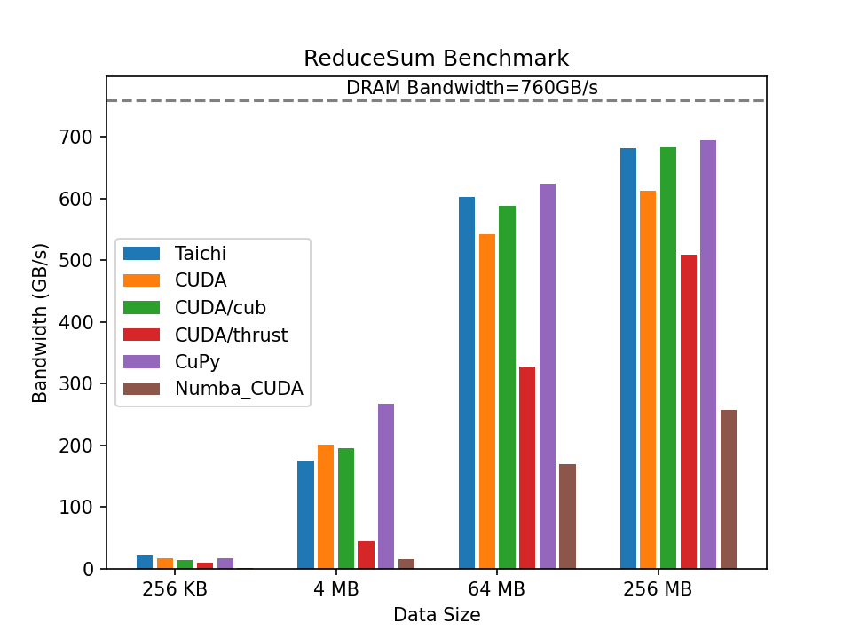

## Python Parallelization Frameworks

We'll be exploring four different methods for horizontally scaling python in this
workshop:

-   :simple-python:{ .lg .middle } __[Python multiprocessing](https://docs.python.org/3/library/multiprocessing.html)__

    ---

    _For when you just need one or two functions to scale. Chances are good that if you
    try to make anything non-trivial, you're going to invest weeks/months of effort to
    discover you've made a junk version of Dask or Celery released 10 years ago._

    !!! quote "Self-authored multiprocessing"
        _**Process #1**_: _Knock, Knock_

        _**Process #2**_: _Whose th_**RACE CONDITION FROM PROCESS #1 BECAUSE YOU DIDN'T
        USE MULTIPROCESSING CORRECTLY**

    **Pros:**

    :material-checkbox-marked-circle:{ .green } Works "out of the box"

    :material-checkbox-marked-circle:{ .green } Potential for batch & streaming (good luck...)

    **Cons:**

    :octicons-x-circle-24:{ .red }
    Race conditions are on you

    :octicons-x-circle-24:{ .red }
    Memory management is on you

    :octicons-x-circle-24:{ .red }
    Synchronization is on you

    :octicons-x-circle-24:{ .red }
    Inter-process dataflow is on you

-   :simple-dask:{ .lg .middle } __[Dask](https://www.dask.org/)__

    ---

    _Use this if you're already planning on using Pandas. If you aren't using Pandas
and all the benefits of optimized C outside of the GIL it brings, it's worth taking a
pause to double-check you CAN'T use it before using something else._

    **Pros:**

    :material-checkbox-marked-circle:{ .green }
    Nearly 1-for-1 API parity with standard Pandas

    :material-checkbox-marked-circle:{ .green }
    Effortless scaling for Dataframe-based workflows

    :material-checkbox-marked-circle:{ .green }
    Support for non-Dataframe tasks

    :material-checkbox-marked-circle:{ .green }
    Painless infrastructure integration

    :material-checkbox-marked-circle:{ .green }
    1st class support for GPUs (via [RAPIDS](https://rapids.ai/))

    **Cons:**

    :octicons-x-circle-24:{ .red }
    Centered around Pandas (columnar data, sorry JSON)

    :octicons-x-circle-24:{ .red }
    Complex workflows aren't a strong suit

    :octicons-x-circle-24:{ .red }
    Getting custom code & dependencies onto workers is a learning curve

    :octicons-x-circle-24:{ .red }
    While streaming may be theoretically possible, it's built for batch workflows

-   :simple-celery:{ .lg .middle } __[Celery](https://docs.celeryq.dev/en/stable/getting-started/introduction.html)__

    ---

    _The Python parallelization swiss-army knife. This can do whatever you're trying to do._

    **Pros:**

    :material-checkbox-marked-circle:{ .green }
    Complex workflows are a specialty

    :material-checkbox-marked-circle:{ .green }
    Integrating your project code & dependencies is the default

    :material-checkbox-marked-circle:{ .green }
    Quirky but relatively painless infrastructure

    :material-checkbox-marked-circle:{ .green }
    Probably [supports where you store your data](https://docs.celeryq.dev/en/stable/userguide/configuration.html)

    **Cons:**

    :octicons-x-circle-24:{ .red }
    Canvas (workflow) API has a learning curve

    :octicons-x-circle-24:{ .red }
    Poor support for arbitrarily long tasks

    :octicons-x-circle-24:{ .red }
    Inter-process JSON messages can be difficult to predict

    :octicons-x-circle-24:{ .red }
    :octicons-moon-16: Flower doesn't have a dark mode

-   :simple-apache:{ .lg .middle } __[Apache Beam](https://beam.apache.org/)__

    ---

    _This is the endgame :muscle: If you're truly starting to scale but don't want to
    ditch Python, then your journey will probably lead here._

    **Pros:**

    :material-checkbox-marked-circle:{ .green }
    Forces effective map-shuffle-reduce patterns

    :material-checkbox-marked-circle:{ .green }
    Potentially fastest (with :simple-apacheflink: Apache Flink) and scales [harder than
    Chuck Norris can kick](https://youtu.be/E6UTz_Doic8?si=pGZkyRAQVMxi-Ymh&t=22)

    :material-checkbox-marked-circle:{ .green }
    1st class support for streaming dataflows and all the complexity that goes along with
    that (windowing, late arrivals, only once, at least once, etc.)

    :material-checkbox-marked-circle:{ .green }
    Leverage existing infrax (:simple-googlecloud: GCP, :simple-apachespark: Spark, etc.)

    :material-checkbox-marked-circle:{ .green }
    Create effective Spark/Flink jobs with Python

    **Cons:**

    :octicons-x-circle-24:{ .red }
    Just an abstraction layer (less the dev-only Direct Runner)

    :octicons-x-circle-24:{ .red }
    Complex infrax setup for self-hosted prod deployment

    :octicons-x-circle-24:{ .red }
    Semi-linked to GCP's DataFlow implementation

    :octicons-x-circle-24:{ .red }
    Chained dependencies cause projects to be stuck with months old libraries

    :octicons-x-circle-24:{ .red }
    Semi-locked in options for sources and sinks

## When are all of these options a bad idea?

Spending weeks learning a new language is likely going to be slower than writing
something in a language you already know today (CPython) and running it. That said,
CPython is very upfront about its inability to use threading. Python 3.12+ is beginning
the slow process of overcoming the Global Interpreter Lock (GIL) inability to support
multiple threads. Details are in [PEP 703](https://peps.python.org/pep-0703/).

Until the GIL supports threads and the Python ecosystem (SciPy, Dask, FastAPI, etc.)
adapts to the change, the best case scenario with Python is multiprocessing using
orders of magnitude more memory, layers of complexity, and slightly more time to
accomplish a task compared to what compiled languages with threading can accomplish with
basic functions.

## Vertically scaling "Python"

While this workshop is focused on **horizontally** scaling Python, it's worth making
some honorable mentions for vertically scaling individual Python interpreters to be
more performant. The theme here is: speed up Python by minimizing the use of Python.

-   :material-language-c:{ .lg .middle } __Wrap C & C++ with Python__

    ---

    This likely isn't new information, but directly [extending Python with C or C++](https://docs.python.org/3/extending/extending.html)
    is how Numpy, Pandas, and much of the CPython standard library is made.

    ---

    **Pros:**

    :material-checkbox-marked-circle:{ .green } You're that dev who can optimize Python with C :fontawesome-solid-hat-wizard:

    **Cons:**

    :octicons-x-circle-24:{ .red } You're the dev trying to optimize Python with C :material-emoticon-poop:

-   :material-language-c:{ .lg .middle } __Compile and Cache Python__

    ---

    [py_compile](https://docs.python.org/3/library/py_compile.html) and
    [functools.lru_cache](https://docs.python.org/3/library/functools.html)
    are "out of the box" and relatively painless ways to speed up your critical path.

    Chances are pretty good that the Python interpreter is already compiling your code
    to `.pyc` files.

    ---

    **Pros:**

    :material-checkbox-marked-circle:{ .green } 1,000x performance increase with 1-line
    of code and no added dependencies

    **Cons:**

    :octicons-x-circle-24:{ .red } If it works and memory holds out :pray_tone3:

-   :simple-numba:{ .lg .middle } __[Numba](https://numba.pydata.org/)__

    ---

    **Step 1**. Put `#!python @jit` above `#!python def my_function()`

    **Step 2**. Magic

    ---

    **Pros:**

    :material-checkbox-marked-circle:{ .green } Possibility of quick-win 1,000x or more
    performance increases for your project

    :material-checkbox-marked-circle:{ .green } Junior devs will think you're an all
    knowing Python god for greatly speeding up the Python codebase

    **Cons:**

    :octicons-x-circle-24:{ .red } If it works...

    :octicons-x-circle-24:{ .red } About as likely as a used mattress to introduce :octicons-bug-24:

    :octicons-x-circle-24:{ .red } Your time is probably better spent learning a
    threaded language rather than a bolt on solution for Python

    :octicons-x-circle-24:{ .red } Senior devs will probably be annoyed you've increased
    the complexity/fragility of the codebase and bloated prod images

-   :simple-taichilang:{ .lg .middle } __[Taichi](https://www.taichi-lang.org/)__

    ---

    You can install it with pip, write it in your `.py` files, and it looks like Python.
    BUT... you're not _really_ using Python anymore. Similar situation as Numba:

    **Step 1**: Hop on a magic carpet with `#!python ti.init(arch=ti.cpu)`

    **Step 2**: Put `#!python @ti.kernel` above your function.

    **Step 3**: Magic

    ---

    **Pros/Cons:**

    Similar tradeoffs as Numba

### Taichi advertised benchmark

### Plain Python **vs** lru_cache **vs** Taichi **vs** Numba
!!! tip "Fibonacci Number Benchmarks"
    The benchmark below is reproducible by running the standalone tests included in the
    workshop's `tests` directory:

    `pytest tests/vertical_scale_test.py --benchmark-histogram`

Key observations from setting up a benchmark for a somewhat "normal" Python function:

1. For idempotent functions called "a lot" with similar input, adding
`#!python @lru_cache` above the function definition is almost certainly the best option.

2. Just-in-time (JIT) compiled solutions (e.g. Taichi & Numba) implicitly fail when
reaching C max/min scalar sizes. Both silently failed when trying to compute numbers
larger than the underlying C can support.

3. Taichi is more "honest" about its limitations. Numba will implicitly fall back to
Python without warning (e.g. the `#!python fib_numba()` test function) when its
assumptions (which in general are the same as Taichi's) aren't met.

4. Added complexity to debug. For example Taichi requires explicitly turning on debugging
in its setup: `#!python taichi.init(debug=True)`

5. If you're writing custom mathematical computation functions **AND** those
functions are a clear bottleneck for the project goals **AND** function input isn't
expected to be repetitive (so cache hits won't help) **AND** the math can't be done
using native numpy/pandas or machine learning library functions **THEN** it **MAY** make
sense to look at optimization solutions like Numba or Taichi.

