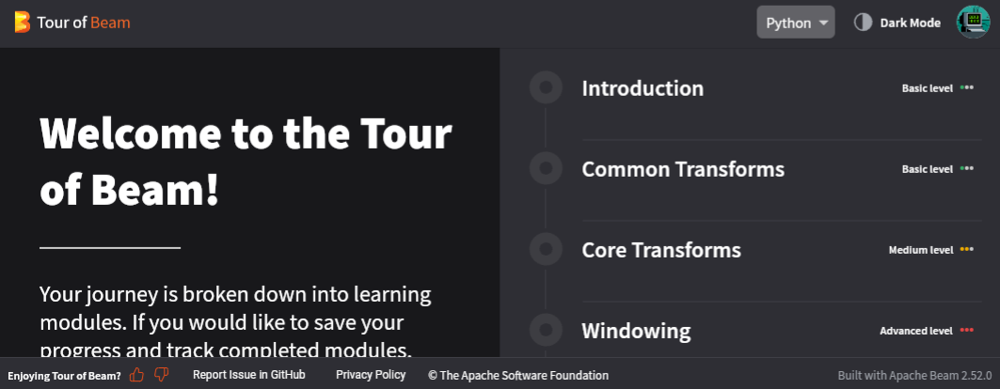
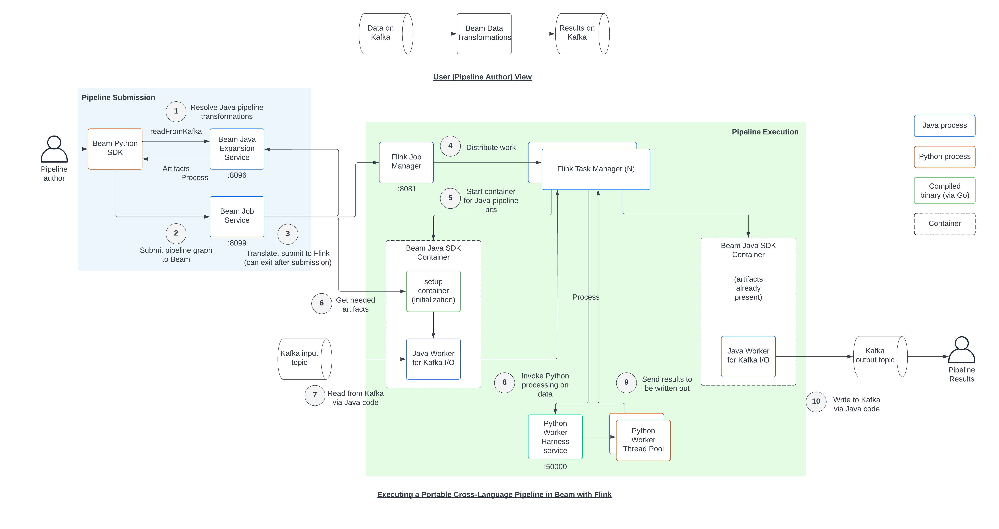

## What is Apache Beam

The [Apache Beam Overview](https://beam.apache.org/get-started/beam-overview/) is a nice
introduction to the framework. The very summarized explanation is it allows you to write
code once, possibly in the language you already use, then run that code on "production"
computation servers like Apache Flink, Spark, or Google Cloud Platform.

---

There's four main benefits to using Apache Beam:

1. The SDK forces you to more-or-less correctly use _map-shuffle-reduce_ programming
patterns that's ready to scale to the moon :rocket:.

2. First class support for streaming data via [windowing](https://beam.apache.org/documentation/programming-guide/#windowing)
and other functionality make it one of the few frameworks that could be integrated into
your organization's "data firehose" to apply AI/ML, heuristics, etc. to intelligently
flag or retain valuable information that may otherwise go undetected/missed because the
volume of data is too much to save into S3 or elsewhere.

3. If your organization already runs a [supported runner](https://beam.apache.org/get-started/beam-overview/#apache-beam-pipeline-runners),
then there's a fairly straightforward developer experience (DX) transitioning code
you've written on your local computer to production. This DX is truly streamlined if
you've got a dev cluster for your runner available that mimics your prod infrastructure.

    !!! note "Linkage with GCP Cloud Dataflow"
        Google is the primary contributor to Apache Beam as it underpins their
        [Google Cloud Platform -- Cloud Dataflow](https://cloud.google.com/dataflow?hl=en)
        service. Be aware that the transition from dev to prod may have more
        "sharp edges" when using runners that aren't Cloud Dataflow. That said, if you ARE
        using Cloud Dataflow then this transition is very smooth.

4. While potentially restrictive, the [available inputs and outputs](https://beam.apache.org/documentation/io/connectors/)
for Beam helps you and your organization avoid pitfalls of trying to pair a technology
(e.g. traditional SQL database like PostgreSQL) that can't gracefully horizontally scale
with code that can.

---

There's also some significant drawbacks, particularly for Python developers using self-
hosted runners like an Apache Spark or Apache Flink cluster.

1. The execution model for "real" Beam pipelines, particularly those not written in
Java, isn't as trivial as the SDK may imply. See [the execution diagram](#real-use-of-apache-beam)
below.

2. For Python devs, you're forever stuck with months old versions of Numpy, Pandas, and
other dependencies as the `apache-beam` Python SDK [has exact versions](https://github.com/apache/beam/blob/master/sdks/python/setup.py)
(ctrl+f "pandas") it requires.

3. The pain points of keeping the Python environment used by Dask/Prefect/Celery workers
synced with local dev environments are magnified by the complex intertwining of Python,
Java, and infrastructure orchestrated by Beam.

## "Tour of Beam"

_Right click and "open in new tab"_

[Tour of Beam :simple-apache:](https://tour.beam.apache.org/){ .md-button .md-button--primary}

**Tour of Beam** is a fully hosted crash course maintained by the Beam authors
and won't be running on our local system. Those that would like to try
self-hosting are encouraged to instead look at the
["Beam Playground source code"](https://github.com/apache/beam/tree/master/playground)
which includes a docker compose based deployment. As with the ["Tour
of Beam source code"](https://github.com/apache/beam/tree/master/learning/tour-of-beam), the
["Beam Playground" has a fully-hosted interactive browser-based interpreter](https://play.beam.apache.org/)
to try out Apache Beam. "Tour of Beam" relies on "Beam Playground" and
Google Cloud Platform (GCP).

## 'Real' Use of Apache Beam

!!! warning "Complex Infrastructure"
    While somewhat detailed and quirky, this workshop's code base and the previous
    sections demonstrate how Dask/Prefect and Celery can be deployed and used by a small
    team. This isn't really the case with Apache Beam. The "big data" Apache ecosystem
    projects like Flink, Spark, and Kafka are non-trivial to get running, much more
    effectively tune and maintain. The dataflow diagram below from the Beam authors hint
    at this significant infrastructure investment.

### Example: Orchestrating Apache Flink
Apache Flink allows for parallel streaming processing of data from either files (batch)
or true streaming (via message broker like Pub/Sub, Kafka, RabbitMQ, etc.).

Two ways for python developers to leverage Flink is either indirectly via Apache Beam
or the native [apache-flink](https://pypi.org/project/apache-flink/) library. For pros
and cons of using Apache Beam, see [this](https://ndeepak.com/posts/2022-07-07-local-beam/)
and [this](https://ndeepak.com/posts/2023-04-26-beam-careful/) article by Deepak Nagaraj.
The complexity highlighted in these article is aluded to by the
[SDK Harness Config docs](https://beam.apache.org/documentation/runtime/sdk-harness-config/)
for Apache Beam which shows the need to package, maintain, and troubleshoot custom docker
images for each execution environment a beam pipeline may try to execute. See the excerpt
of this complex workflow for basic Apache Beam tasks below.

